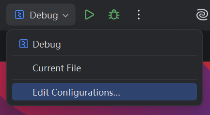
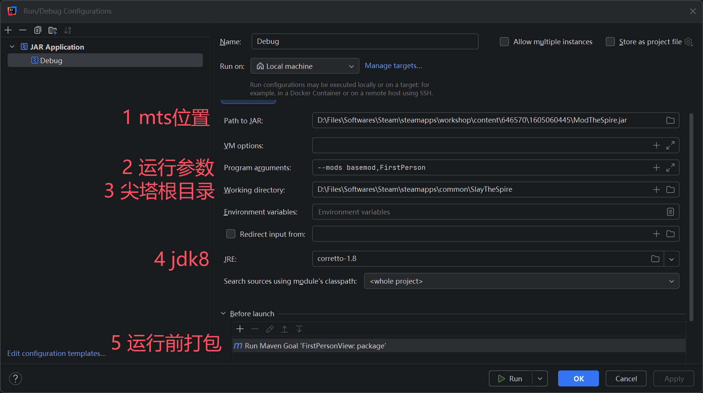

# 一键开启mod调试

你发现想要调试一个mod需要先打包、然后回到steam启动游戏、再进入mts加载mod、然后才能测试，整个过程非常繁琐。其实我们可以在ide里设置一键运行整个流程，甚至能够断点调试。

## IDEA

点击右上角的调试配置按钮，选择`Edit Configurations...`。



点击左上角的`+`，选择`Application`。

1. `Path to JAR`选择你`ModTheSpire`的位置。
2. `Program arguments`选填，参考[MTS Wiki](https://github.com/kiooeht/ModTheSpire/wiki/Command-Line-Arguments)。方便起见你可以填写`--mods basemod,[你的mod id]`，这样就不用在mts里重新选择一遍了。当然你可以添加更多mod。
3. `Working directory`选择你的尖塔游戏根目录。
4. `JRE`选择一个java8（1.8）的版本。
5. `Before launch`点击`+`，选择`Run Maven Goals`，然后写入`package`，这样每次运行前都会自动打包你的mod。



点击`OK`保存。现在你可以直接点击右上角的运行或调试按钮来启动游戏并加载你的mod了！

当然你也可以进行断点调试。点击某一行代码左侧的空白处即可添加断点。运行调试后，游戏会在断点处暂停，你可以查看变量、单步执行等。

## VSCode

在`.vscode`里新建一个`launch.json`文件，写入以下内容：

```json
{
  "version": "0.2.0",
  "configurations": [
    {
      "type": "java",
      "name": "Debug",
      "request": "launch",
      "mainClass": "com.megacrit.cardcrawl.desktop.DesktopLauncher",
      // 相当于上面的Program arguments
      "args": ["--mods", "basemod,RyoikiTenkai,better-debug"],
      // 相当于上面的Working directory
      "cwd": "D:\\Files\\Softwares\\Steam\\steamapps\\common\\SlayTheSpire",
      // 相当于上面的JRE，选择一个java8（1.8）的版本
      "javaExec": "C:\\Program Files\\Eclipse Adoptium\\jdk-8.0.452.9-hotspot\\bin\\java.exe",
      // 需要和下面写的tasks.json里的task name一致
      "preLaunchTask": "maven-package",
      // 相当于上面的Path to JAR
      "classPaths": [
        "D:\\Files\\Softwares\\Steam\\steamapps\\workshop\\content\\646570\\1605060445\\ModTheSpire.jar"
      ]
    }
  ]
}

```

然后在`.vscode`里新建一个`tasks.json`文件，写入以下内容：

```json
{
    "version": "2.0.0",
    "tasks": [
        {
            "label": "maven-package",
            "type": "shell",
            "command": "mvn package",
            "group": {
                "kind": "build",
                "isDefault": true
            },
            "presentation": {
                "reveal": "silent",
                "clear": true,
                "panel": "shared"
            },
            "problemMatcher": [
                "$msCompile"
            ]
        }
    ]
}
```